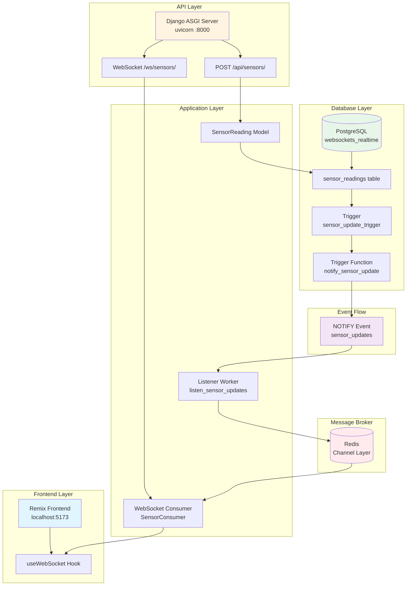
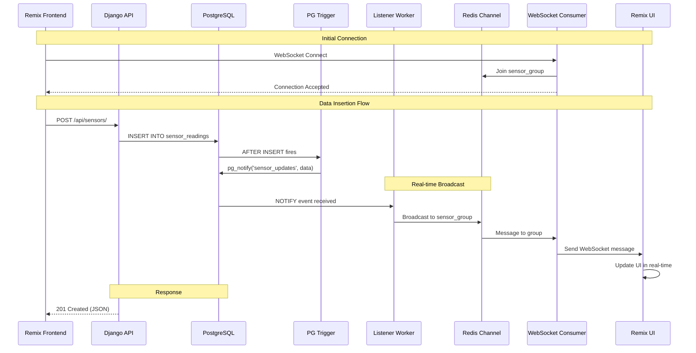

# Websockets Postres Realtime Subscriptions

Complete real-time data system using Django + PostgreSQL LISTEN/NOTIFY + WebSockets + Remix.

## Architecture



### Data Flow



## Prerequisites

- **Python 3.13+** with `uv` package manager
- **Node.js 20+** and npm
- **PostgreSQL** (running locally or remote)
- **Redis** (for channel layer)

### Install Prerequisites

**macOS:**
```bash
# Install uv
curl -LsSf https://astral.sh/uv/install.sh | sh

# Install PostgreSQL
brew install postgresql@14
brew services start postgresql@14

# Install Redis
brew install redis
brew services start redis

# Install Node.js (if not installed)
brew install node
```

**Linux:**
```bash
# Install uv
curl -LsSf https://astral.sh/uv/install.sh | sh

# Install PostgreSQL
sudo apt-get install postgresql postgresql-contrib
sudo systemctl start postgresql

# Install Redis
sudo apt-get install redis-server
sudo systemctl start redis-server

# Install Node.js
curl -fsSL https://deb.nodesource.com/setup_20.x | sudo -E bash -
sudo apt-get install -y nodejs
```

## Setup

### 1. Clone and Navigate

```bash
cd websockets-postgres-realtime-subscription
```

### 2. Backend Setup

```bash
cd backend

# Install dependencies
uv sync

# Create .env file from example
cp .env.example .env

# Edit .env with your database credentials
# Required variables:
# - SECRET_KEY
# - DEBUG=True
# - DB_NAME=websockets_realtime
# - DB_USER=your_postgres_user
# - DB_PASSWORD=your_postgres_password
# - DB_HOST=localhost
# - DB_PORT=5432
# - REDIS_HOST=localhost (optional, defaults to localhost)
# - REDIS_PORT=6379 (optional, defaults to 6379)

# Create PostgreSQL database
createdb websockets_realtime
# OR
psql -U postgres -c "CREATE DATABASE websockets_realtime;"

# Run migrations (creates tables and triggers)
uv run manage.py migrate
```

### 3. Frontend Setup

```bash
cd ../frontend

# Install dependencies
npm install
```

## Starting the System

You need **3 terminal windows** running simultaneously:

### Terminal 1: Django ASGI Server

```bash
cd backend
uv run uvicorn config.asgi:application --host 0.0.0.0 --port 8000 --reload
```

**Expected output:**
```
INFO:     Started server process
INFO:     Waiting for application startup.
INFO:     Application startup complete.
INFO:     Uvicorn running on http://0.0.0.0:8000
```

### Terminal 2: Listener Worker

```bash
cd backend
uv run manage.py listen_sensor_updates
```

**Expected output:**
```
Listening for sensor updates...
```

### Terminal 3: Remix Frontend

```bash
cd frontend
npm run dev
```

**Expected output:**
```
  VITE v5.x.x  ready in xxx ms

  ➜  Local:   http://localhost:5173/
```

## Testing the System

### 1. Open Frontend

Navigate to `http://localhost:5173` in your browser. You should see:
- Status: 🟢 Connected
- Waiting for sensor data...

### 2. Create Sensor Reading

In a new terminal, send a POST request:

```bash
curl -X POST http://localhost:8000/api/sensors/ \
  -H "Content-Type: application/json" \
  -d '{
    "sensor_id": "sensor1",
    "value": 25.5,
    "metadata": {"unit": "celsius", "location": "room1"}
  }'
```

**Expected response:**
```json
{
  "id": 1,
  "sensor_id": "sensor1",
  "value": 25.5,
  "timestamp": "2025-11-16T10:39:13.474702+00:00",
  "metadata": {"unit": "celsius", "location": "room1"},
  "message": "Sensor reading created successfully"
}
```

### 3. Watch Real-time Update

The frontend should automatically display the new sensor reading without refreshing the page! 🚀

## API Reference

### POST /api/sensors/

Create a new sensor reading.

**Request:**
```json
{
  "sensor_id": "sensor1",
  "value": 25.5,
  "metadata": {"unit": "celsius", "location": "room1"}
}
```

**Response:** `201 Created`
```json
{
  "id": 1,
  "sensor_id": "sensor1",
  "value": 25.5,
  "timestamp": "2025-11-16T10:39:13.474702+00:00",
  "metadata": {"unit": "celsius", "location": "room1"},
  "message": "Sensor reading created successfully"
}
```

### WebSocket: ws://localhost:8000/ws/sensors/

Connect to receive real-time sensor updates.

**Connection:**
```javascript
const ws = new WebSocket('ws://localhost:8000/ws/sensors/');
```

**Message Format:**
```json
{
  "data": {
    "id": 1,
    "sensor_id": "sensor1",
    "value": 25.5,
    "timestamp": "2025-11-16T10:39:13.474702+00:00",
    "metadata": {"unit": "celsius"}
  }
}
```

## How It Works

1. **HTTP POST** → Creates `SensorReading` in database
2. **PostgreSQL Trigger** → Fires `notify_sensor_update()` function
3. **NOTIFY Event** → PostgreSQL broadcasts to all listeners
4. **Listener Worker** → Receives NOTIFY and broadcasts to Redis channel
5. **Redis Channel Layer** → Distributes message to all WebSocket consumers
6. **WebSocket Consumer** → Sends message to all connected clients
7. **Remix Frontend** → Updates UI in real-time without polling

## Project Structure

```
.
├── backend/              # Django backend
│   ├── config/           # Django settings and ASGI config
│   ├── sensors/          # Sensor app
│   │   ├── models.py     # SensorReading model
│   │   ├── consumers.py  # WebSocket consumer
│   │   ├── views.py      # REST API endpoint
│   │   ├── routing.py    # WebSocket routing
│   │   └── management/   # Listener worker command
│   ├── .env              # Environment variables (create from .env.example)
│   └── manage.py         # Django management script
├── frontend/             # Remix frontend
│   ├── app/
│   │   ├── hooks/        # useWebSocket hook
│   │   └── routes/       # Remix routes
│   └── package.json
└── README.md             # This file
```

## Troubleshooting

### WebSocket not connecting

1. **Check Redis is running:**
   ```bash
   redis-cli ping
   # Should return: PONG
   ```

2. **Verify using ASGI server (not runserver):**
   ```bash
   # ✅ Correct
   uv run uvicorn config.asgi:application --port 8000
   
   # ❌ Wrong (WSGI doesn't support WebSockets)
   uv run manage.py runserver
   ```

3. **Check listener worker is running:**
   ```bash
   # Should see: "Listening for sensor updates..."
   ```

### No real-time updates

1. **Verify PostgreSQL trigger exists:**
   ```bash
   psql -U your_user -d websockets_realtime -c "\d sensor_readings"
   # Should show: sensor_update_trigger
   ```

2. **Check listener worker logs:**
   - Should see: "Broadcasted update: {...}"

3. **Verify Redis connection:**
   ```bash
   redis-cli ping
   ```

### Frontend not receiving updates

1. **Check browser console:**
   - Look for WebSocket connection errors
   - Verify connection status shows "Connected"

2. **Verify WebSocket URL:**
   - Should be: `ws://localhost:8000/ws/sensors/`
   - Check for CORS issues if frontend is on different domain

3. **Check network tab:**
   - Verify WebSocket connection is established (Status 101)

### Database connection errors

1. **Verify PostgreSQL is running:**
   ```bash
   psql -U your_user -d websockets_realtime -c "SELECT 1;"
   ```

2. **Check .env file:**
   - Verify all database credentials are correct
   - Ensure database exists

## Development

### Backend Development

```bash
cd backend

# Run with auto-reload
uv run uvicorn config.asgi:application --port 8000 --reload

# Run Django shell
uv run manage.py shell

# Create new migration
uv run manage.py makemigrations

# Apply migrations
uv run manage.py migrate
```

### Frontend Development

```bash
cd frontend

# Start dev server with hot reload
npm run dev

# Build for production
npm run build

# Type check
npm run typecheck
```

## Production Deployment

### Backend

1. **Set environment variables:**
   ```bash
   export SECRET_KEY="your-production-secret-key"
   export DEBUG=False
   export DB_NAME="websockets_realtime"
   export DB_USER="your_db_user"
   export DB_PASSWORD="your_db_password"
   export DB_HOST="your_db_host"
   export DB_PORT="5432"
   export REDIS_HOST="your_redis_host"
   export REDIS_PORT="6379"
   ```

2. **Run migrations:**
   ```bash
   uv run manage.py migrate
   ```

3. **Start ASGI server:**
   ```bash
   uv run uvicorn config.asgi:application --host 0.0.0.0 --port 8000
   ```

4. **Start listener worker (as background service):**
   ```bash
   # Using systemd
   sudo systemctl start sensor-listener
   
   # OR using supervisor
   supervisorctl start sensor-listener
   ```

### Frontend

```bash
cd frontend

# Build
npm run build

# Start production server
npm start
```

## Components

### Backend

- **Django Channels** - WebSocket support via ASGI
- **PostgreSQL Trigger** - Automatic NOTIFY on INSERT
- **Listener Worker** - Receives NOTIFY and broadcasts via Redis
- **WebSocket Consumer** - Handles client connections
- **REST API** - Create sensor readings

### Frontend

- **Remix** - React framework with file-based routing
- **useWebSocket Hook** - Custom hook for WebSocket connection
- **Real-time UI** - Displays latest sensor data automatically

## License

MIT
